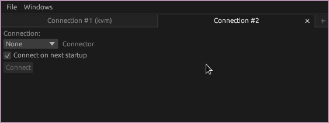
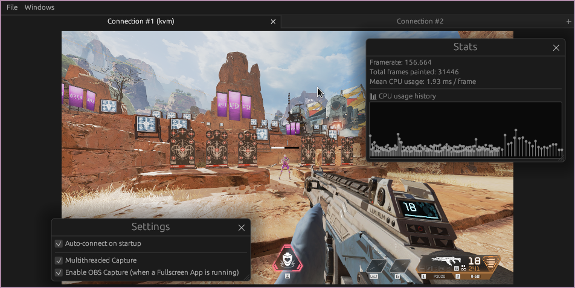

# memflow-mirror

work in progress framebuffer mirror based on [memflow](https://github.com/memflow/memflow).

## Installation
Compile the guest-agent on Windows with:
```bash
cargo build --release --bin mirror-guest --all-features
```
Then run the mirror-guest.exe from the target/release/ directory.

In case you encounter a `No such file or directory` error from the build.rs script make sure to install the [dependencies of the winres crate](https://github.com/mxre/winres#toolkit).

Run the mirror tool with:
```bash
cargo run --release --bin mirror --all-features -- -vv
```

It is recommended to use the [memflow-kvm](https://github.com/memflow/memflow-kvm) connector as it currently has the best performance.

## Setup
### With memflow inventory
When running the mirror tool with the `default` features the memflow inventory will be used.
Since this project depends on memflow/next it is necessary to install [memflow-win32](https://github.com/memflow/memflow-win32) and a connector.
The simplest method currently is to use the [memflowup](https://github.com/memflow/memflowup) tool which has an interactive installation mode:
```sh
curl --proto '=https' --tlsv1.2 -sSf https://sh.memflow.io | sh
```
Then follow the on-screen-instructions.

## Demo

[](http://www.youtube.com/watch?v=H-1wxAeocGA "mirror demo")

## Screenshots




## Credits

[dxgcap](https://github.com/bryal/dxgcap-rs) by [bryal](https://github.com/bryal)

[obs-rs](https://github.com/not-matthias/obs-rs) by [not-matthias](https://github.com/not-matthias)

## License

Licensed under MIT License, see [LICENSE](LICENSE).

### Contribution

Unless you explicitly state otherwise, any contribution intentionally submitted for inclusion in the work by you, shall be licensed as above, without any additional terms or conditions.
